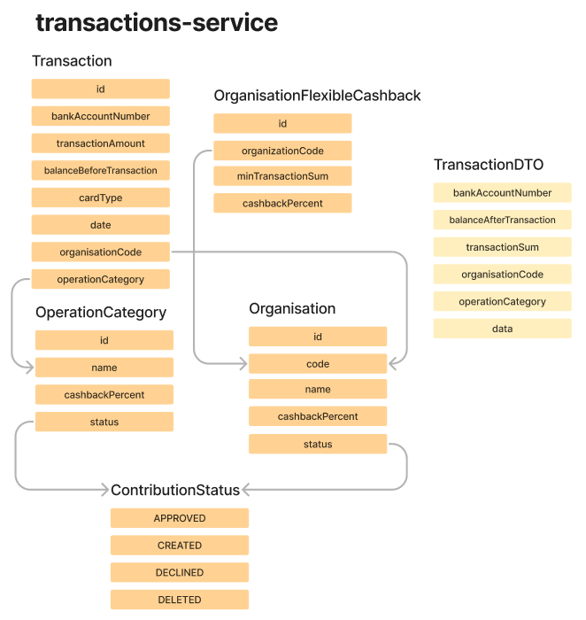

# ✈️ Transactions Microservice

This microservice is responsible for .

# 📝 .xtend Models

There are 5 .xtend models within this microservice:

- [ContributionStatus.xtend](https://gitlab.croc.ru/CROC.DRPO_RnD/jxfw/sandbox/school2023/team4/transactions-service/-/blob/main/src/main/java/ru/croc/transactions/domain/ContributionStatus.xtend)
- [OperationCategory.xtend](https://gitlab.croc.ru/CROC.DRPO_RnD/jxfw/sandbox/school2023/team4/transactions-service/-/blob/main/src/main/java/ru/croc/transactions/domain/OperationCategory.xtend)
- [Organization.xtend](https://gitlab.croc.ru/CROC.DRPO_RnD/jxfw/sandbox/school2023/team4/transactions-service/-/blob/main/src/main/java/ru/croc/transactions/domain/Organization.xtend)
- [OrganizationFlexibleCashback.xtend](https://gitlab.croc.ru/CROC.DRPO_RnD/jxfw/sandbox/school2023/team4/transactions-service/-/blob/main/src/main/java/ru/croc/transactions/domain/OrganizationFlexibleCashback.xtend)
- [Transaction.xtend](https://gitlab.croc.ru/CROC.DRPO_RnD/jxfw/sandbox/school2023/team4/transactions-service/-/blob/main/src/main/java/ru/croc/transactions/domain/Transaction.xtend)

# ↔️ The relationship between the entities can be represented by the following diagram.



# 📥 Endpoints

This microservice has only one REST endpoint:
/api/v1/transactions/handle-cashback-transaction - Generate a new transaction of cashback accrual on the input transaction

`How to use this endpoint?`

You should send Transaction in json format, for example:

```json
{
  "bankAccountNumber": "5cc4ed6a-c2c7-4163-bc29-bc76c3ee9cad",
  "organisationCode": "2c88db9d-9d6f-4fcd-b6e8-e85ede92b997",
  "transactionSum": "123.2",
  "balanceAfterTransaction": "14044.3",
  "operationCategory": "RESTAURANTS",
  "date": "2023-07-25"
}
```

And if the bank account number is valid and there is a card linked to this bank account number, you will receive `200 OK` status code and another TransactionDTO in json, where field transactionSum is now representing sum of the cashback:

```json
{
  "bankAccountNumber": "5cc4ed6a-c2c7-4163-bc29-bc76c3ee9cad",
  "organisationCode": "2c88db9d-9d6f-4fcd-b6e8-e85ede92b997",
  "transactionSum": "50.0",
  "balanceAfterTransaction": "14044.3",
  "operationCategory": "RESTAURANTS",
  "date": "2023-07-25"
}
```

But if some data was wrong (invalid bank account, organization or category name), you will receive `400 Bad Request` status code and error message in json:

```json
{
    "message": "Operation category with this name is not in database!"
}
```
